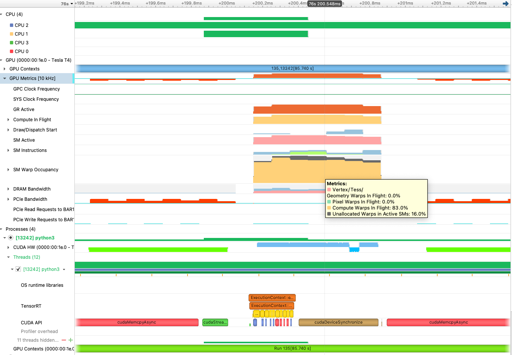
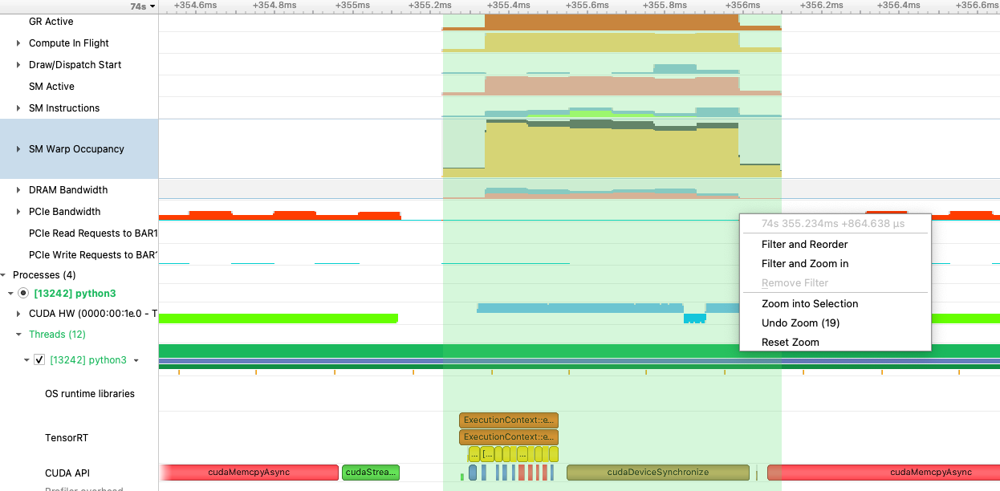
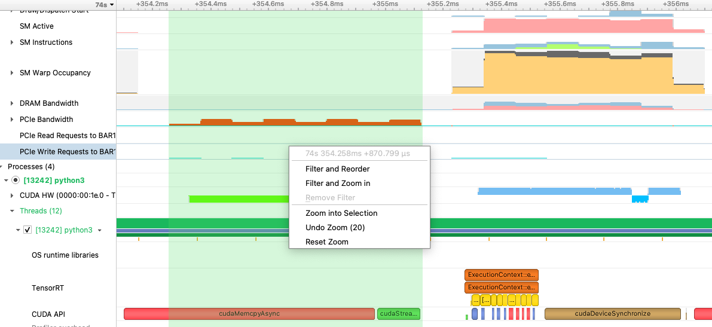
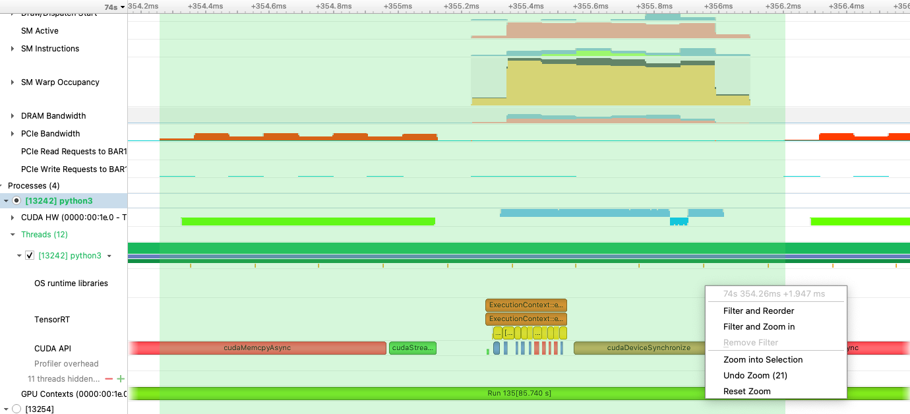
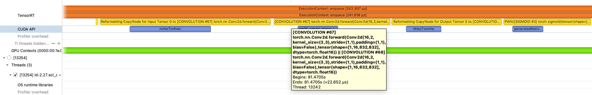
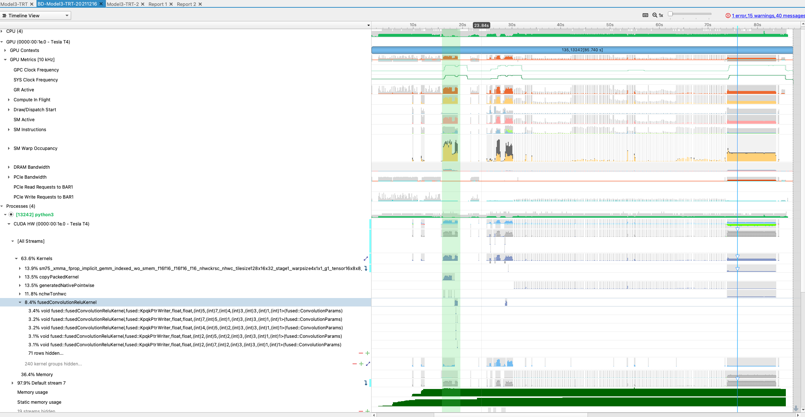
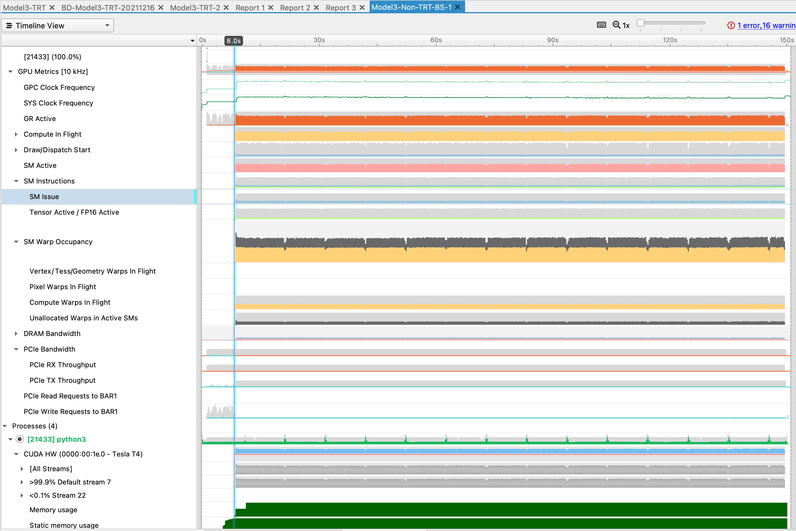
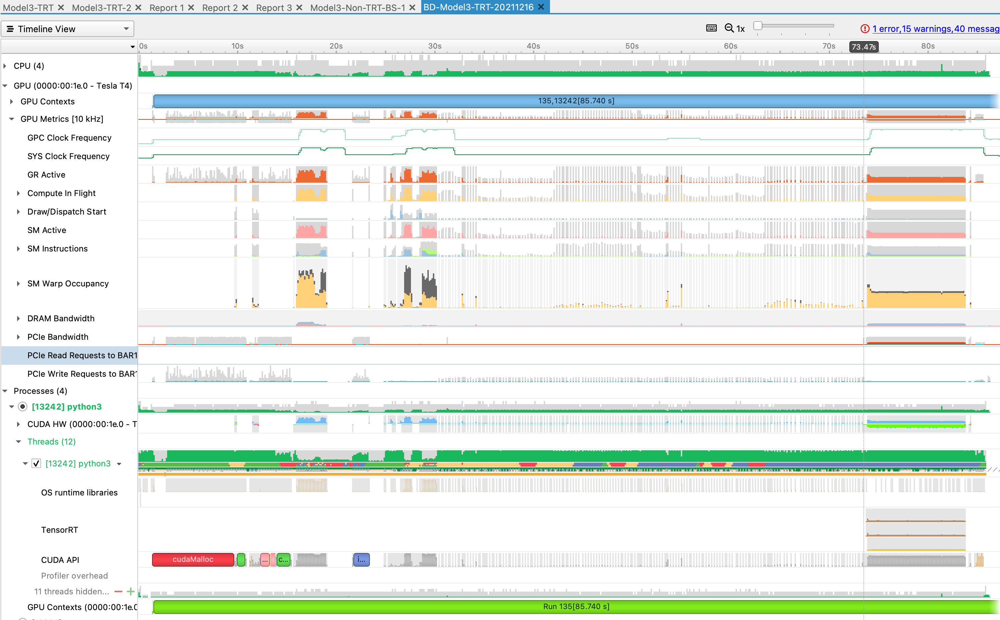
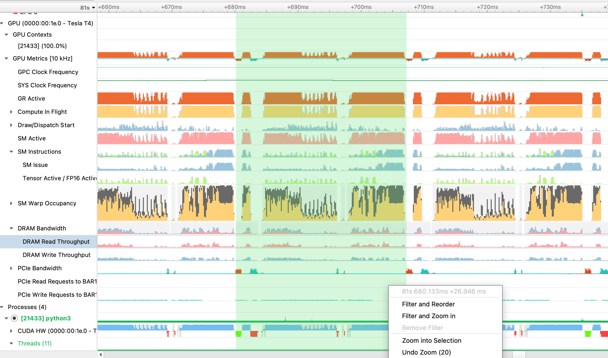

# Profiling-TensorRT-Model-with-Nvidia-Nsight-Systems

## Introduction
This document presents the findings and discussion of profiling a TensorRT - optimized model using Nvidia Nsight Systems. The EC2 instance used for profiling is g4dn.xl which contains one Nvidia T-4 GPU. Details about Nsight System setup is documented [here](https://github.com/kct22aws/Nvidia-Nsight-Systems-on-Inferentia). 

## Results

The following sections present profiling results of the model in TensorRT version. The visualization is captured by an .nsys-rep file. To open it, use Nsight Systems desktop UI (File → Open)

## PCIE Bandwidth

Since data reaches GPU for computation via PCIe interface, I looked at the PCI bandwidth and utilization. The figure below shows that GPU (GR Active row) is idle while data transfer occurs on PCIe:



CPU transfers or writes data to VRAM over PCIe . Once the data transfer ends, notice that in TensorRT row, ExecutinContext starts, and in SM Warp Occupancy row, Compute Warps utilization of the CUDA Cores reaches 83%, with 16% free to spare. Once CUDA API completed the cudaDeviceSynchronize, it represents the Compute Warps completion, and new data start to appear on PCIe Write row, which means the CPU is writing new data to VRAM for next iteration.

## Cuda Core execution time per inference iteration

The time from start to end of Cuda Core consumption by the compute (SM Warp Occupancy) is less than 1 ms:



In the case shown above, it’s 864.638 µs.

## Data transfer time per inference iteration

The time it takes for host to transfer data to VRAM is shown with the PCIe bandwidth:



In this case it is 870.799 us. 

## End-to-end latency per inference iteration

From the time data appears on PCIe interface to the next iteration, the end-to-end time to complete one inference is shown as below:



For this particular inference sample, the total end-to-end inference time is 1.947 ms. Below is the benchmark application’s results based on all inference samples:

```
ubuntu@ip-XXXX:~/model3/from_others/torch2trt$ python3 performance_bd_head_trt.py
backbone inner_channels: 256

Batch size: 1
Samples: 5000
Models: 1
Dtype: torch.float16
Duration: 8.860
Throughput: 564.309
Latency P50: 1.756
Latency P95: 1.792
Latency P99: 1.844
```

## TensorRT execution

It appears TensorRT also fuses multiple convolution ops. This can be seen in one of the blocks under TensorRT ExecutionContext:



However, since the model-3 contains a  ResNet 50 backbone, there should be 48 convolution layers. See [here](https://iq.opengenus.org/resnet50-architecture/). It is not clear where all other convolution ops are located. 

## Kernel launch

At early stage of the profiling trace (slightly after 10s), kernels are launched in the Cuda hardware:



Ops fused or optimized by TensorRT get loaded to the Cuda hardware before 20s mark.

## Non-TensorRT vs. TensorRT profiling

As a comparison, Non-TensorRT model was also profiled in the same GPU. Overall profile appears as the figure below:



Below is the entire profile view for the TensorRT model:



Several observations are made from the profile above:

1. For Non-TensorRT model, starting at 8s, and through 160s, Cuda hardware, PCIe bandwidth, SM Warp occupancy (instructions) and GR Activity are running at high saturation.
2. For TensorRT model, inference starts at around 74.4s, and Cuda hardware, PCIe bandwisth, SM Warp occupancy and GR Activity started to run at high saturation.
3. For TensorRT model, CUDA core activity is only saturated after 73s mark and finished the entire 5000 iterations within 15s.

## Inferencing iteration

Below is a zoomed view at inferencing iteration level for Non-TensorRT model:



Green shade corresponds to 26.9 ms latency for one inference. Comparing to TensorRT model:


Some observations are:


1. Within an iteration, Non-TensorRT model have inconsistent SM Warp Occupancy and GPU utilization as indicated by GR Active level. 
2. Data appears on PCIe read/write more frequently in Non-TensorRT model, suggesting unlike TensorRT model, Non optimized model running in GPU are engaged in read/write throughout the entire iteration.
3. TensorRT optimization reduces inferencing latency by at least 10x.
4. As demonstrated in this case, time for data transfer on PCIe interface is similar to that of Cuda Core spent in compute, and during compute, there were no data transfer on PCIe. Which means Cuda Cores has all necessary data and are not wasting time on data transfer during compute.


